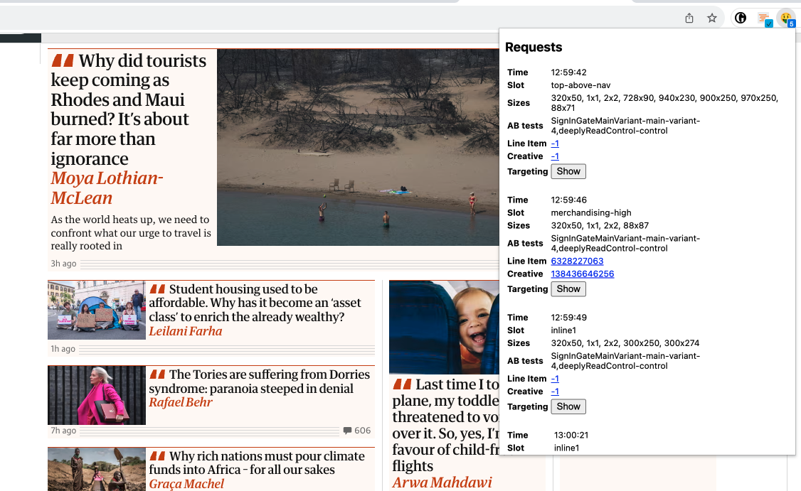

# Coach ComDev

This is a browser extension built for the guardian, at the moment all it does is show you information about the GAM requests that occur on the page you are viewing.

Built using SvelteKit and TypeScript.



## Installing

To install the extension, build the extension, find the zip file in `dist/coach-comdev.zip` and unzip it. Then follow the instructions below for your browser.

### Building

To build the extension, you will need to have [node](https://nodejs.org/en/)  and [pnpm](https://pnpm.js.org/) installed.

```bash
pnpm install
pnpm run build
```

This will create a `build` folder with the built extension.

You can also run `pnpm run dist` to build and create a zip file of the extension in the `dist` folder.

### Loading

To load the extension into your browser, you will need to enable developer mode in your browser and then load the extension.

#### Chrome

1. Open the Extension Management page by navigating to `chrome://extensions`. The Extension Management page can also be opened by clicking on the Chrome menu, hovering over **More Tools** then selecting **Extensions**.

2. Enable Developer Mode by clicking the toggle switch next to **Developer mode**.

3. Click the **LOAD UNPACKED** button and select the extension directory.

#### Firefox

Not available yet.

## Development

The extension comprises a popup (most of [src](./src), [service-worker](./src/service-worker.ts) and a [content script](./src/content-script.ts). The popup is built using SvelteKit, the service-worker is written in Typescript and the content script is built as a single Svelte component that is injected into the page.

Live reloading does not work as chrome needs the built files to be in the `build` folder.

So you need to do a full build to see changes reflected in the extension.

